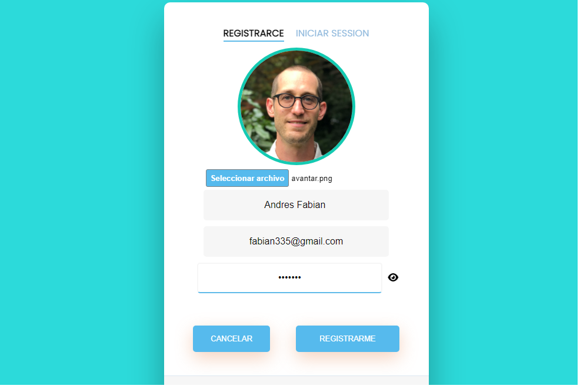
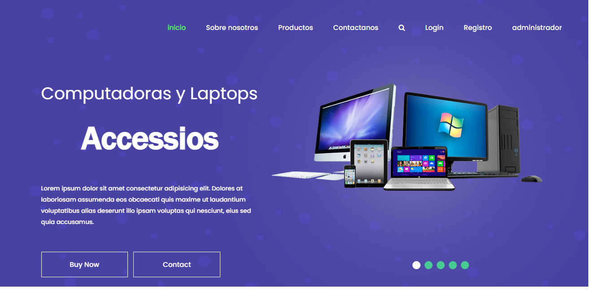

# tiendaBit-Laravel

Mini tienda de venta de productos de tecnologia en linea, los archivos multimedia se encuentran alojados en un bucket AMAZON S3, mediante una conexion apuntando al servidor en el archivo .evn que proporciona LARAVEL V-9.

  
  
  
  
  
  

</p

***INSTALACION***

1-INSTALACION DE LARAVEL(ULTIMA VERSION).
2-INSTALACION DE COMPOSER(ULTIMA VERSION).
3-INSTALACION DE PHP(EN SU ULTIMA VERSION).
4-INSTALACION DE HOSTLOCAL(XAMPP O CUALQUIER OTRO) CON MYSQL.
5-CUENTA EN AMAZON-S3, UNA VEZ REGISTRADO CAMBIAR TODAS LAS CREDENCIALES APUNTANDO AL NUEVO BUCKET.
6-POR COMODIDAD INSTALACION DE GIT-BASH PARA REALIZAR LAS PETICIONES PHP ARTISAN.
7-ENTORNO DE DESARROLLO VISULA STUDIO O EL NECESARIO.
